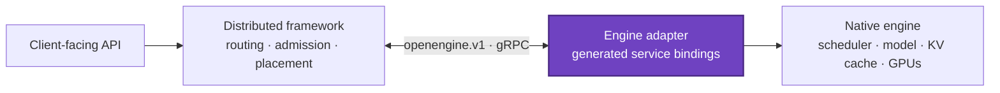

<!--
SPDX-FileCopyrightText: Copyright (c) 2026 NVIDIA CORPORATION & AFFILIATES. All rights reserved.
SPDX-License-Identifier: Apache-2.0
-->

<p align="center">
  
</p>

<h1 align="center">OpenEngine</h1>

<p align="center">
  <strong>OpenEngine is a vendor-neutral gRPC protocol for coordinating inference engines and distributed frameworks.</strong>
</p>

<p align="center">
  Keep engine execution native. Connect distributed systems through one typed runtime contract.
</p>

<p align="center">
  <a href="https://github.com/ai-dynamo/openengine/actions/workflows/buf.yml"></a>
  <a href="LICENSE"></a>
  <a href="#project-status"></a>
  <a href="proto/openengine.proto"></a>
  <a href="https://grpc.io/"></a>
  <a href="https://protobuf.dev/"></a>
</p>

<p align="center">
  <a href="docs/motivation.md">Why OpenEngine?</a>
  · <a href="docs/api.md">API reference</a>
  · <a href="proto/openengine.proto">Canonical proto</a>
  · <a href="CONTRIBUTING.md">Contributing</a>
</p>

> [!IMPORTANT]
> OpenEngine is experimental and pre-adoption. The contract is being refined
> before its first engine implementations and may make direct breaking changes
> while it remains at schema revision `1`.

## Table of contents

- [Overview](#overview)
- [Why OpenEngine](#why-openengine)
- [Design principles](#design-principles)
- [Architecture](#architecture)
- [Capabilities](#capabilities)
- [API surface](#api-surface)
- [Generation and streaming](#generation-and-streaming)
- [Error model](#error-model)
- [Schema compatibility](#schema-compatibility)
- [Getting started](#getting-started)
- [Repository layout](#repository-layout)
- [Project status](#project-status)
- [Contributing](#contributing)
- [Security](#security)
- [License](#license)
- [Related projects and tools](#related-projects-and-tools)

## Overview

OpenEngine defines the runtime boundary between an inference engine and a
distributed framework. An engine exposes the `openengine.v1.OpenEngine` gRPC
service; the framework connects as a generated client.

The engine remains responsible for request execution: scheduling, batching,
tokenization, KV-cache management, multimodal preprocessing, guided decoding,
and engine-specific optimization. The distributed framework remains responsible
for routing, admission, placement, lifecycle policy, and coordination across
workers.

OpenEngine carries the typed information those systems need to exchange without
requiring them to share a process, Python environment, dependency tree, or
private control API.

OpenEngine is a runtime protocol—not a client-facing chat or completion API. A
distributed framework can accept OpenAI-compatible traffic at its edge and use
OpenEngine between its router and engine workers.

## Why OpenEngine

Without a shared runtime boundary, every engine-framework pair needs a custom
adapter that tends to copy launch flags, import engine internals, or depend on
scheduler implementation details.

| Without a shared contract | With OpenEngine |
|---|---|
| Pairwise engine-framework integrations | One generated service contract |
| Configuration duplicated into sidecars | Engine capabilities discovered over RPC |
| Engine upgrades coupled to framework code | Engine-native execution behind a common endpoint |
| Ad hoc cancellation and failure behavior | Explicit lifecycle and terminal error semantics |
| Backend-specific KV handoff shapes | Typed sessions with backend-specific extension data |

Read [Why OpenEngine](docs/motivation.md) for the full motivation, boundary, and
adoption model.

## Design principles

- **Engine-owned execution.** OpenEngine describes the boundary; it does not
  standardize schedulers, kernels, batching policies, or cache internals.
- **Discovery over duplicated configuration.** Roles, models, topology, limits,
  and supported generation features come from the engine.
- **Portable core, native extensions.** Common behavior is strongly typed while
  backend-specific KV transfer data has an explicit extension point.
- **Presence has meaning.** Optional scalars distinguish an unknown or defaulted
  value from an explicit zero or `false`.
- **Unambiguous streams.** Output ownership, incremental deltas, terminal events,
  usage, and failures have defined request- and output-level scope.
- **Generated bindings.** The protobuf schema is the canonical contract for both
  clients and servers.

## Architecture



The adapter maps OpenEngine messages onto the engine's existing request path.
Native APIs can continue to exist for direct clients; OpenEngine provides the
framework-facing control and generation surface.

## Capabilities

| Area | What the contract provides |
|---|---|
| Portable generation | Text or token input, sampling, stopping, priorities, multiple sequences, and deterministic seeds |
| Structured output | JSON Schema, JSON object, regex, EBNF grammar, structural tags, and fixed choices |
| Token information | Prompt and output logprobs, ranks, candidate-token selection, per-token records, and streamed text deltas |
| Discovery | Engine identity, schema revision, role, model limits, topology, parser configuration, and generation capabilities |
| Lifecycle | Health checks, targeted or global abort, graceful drain, progress, and terminal failures |
| Disaggregated serving | Prefill/decode roles, KV session handoff, connector discovery, rank affinity, and cache controls |
| KV-aware routing | Typed KV event streams plus discovery of engine-native event sources |
| Model extensions | Multimodal inputs and LoRA adapter lifecycle |
| Observability | Point-in-time load snapshots and structured runtime event streams |

## API surface

The complete service is defined in
[`proto/openengine.proto`](proto/openengine.proto).

| Area | RPCs |
|---|---|
| Generation | `Generate` |
| Engine and model metadata | `GetEngineInfo`, `GetModelInfo` |
| Load and scheduling state | `GetLoad` |
| Health and lifecycle | `Health`, `Abort`, `Drain` |
| LoRA lifecycle | `LoadLora`, `UnloadLora`, `ListLoras` |
| KV connectors and events | `GetKvConnectorInfo`, `GetKvEventSources`, `SubscribeKvEvents` |
| Runtime events | `SubscribeRuntimeEvents` |

See the [human-readable API reference](docs/api.md) for field-level behavior and
validation rules.

## Generation and streaming

`Generate` is always server-streaming. A request separates sampling, stopping,
response, KV/cache, and guided-decoding concerns without exposing a native
engine request dictionary.

| Stream event | Scope | Meaning |
|---|---|---|
| `PromptOutput` | Request | Prompt token information, emitted at most once |
| `TokenOutput` | Output index | Newly emitted token records and text; never cumulative |
| `PrefillReady` | Request | Terminal success for a prefill-only request and its KV handoff |
| `GenerationFinished` | Output index | Exactly one successful terminal event per requested output |
| `EngineError` | Request | Terminal accepted-request failure; ends every unfinished output |

For multiple sequences, each `TokenOutput` and `GenerationFinished` carries a
stable `output_index`. `Usage` is cumulative across the request and appears only
on its final response. A matched stop token, stop string, or model EOS token is
reported explicitly.

## Error model

Every RPC uses the same boundary between validation, accepted work, and
transport failure:

| Failure phase | Representation | Completion |
|---|---|---|
| Before acceptance | Non-OK gRPC status | No response event |
| After a streaming request is accepted | One terminal `EngineError` | Stream closes with gRPC `OK` |
| Transport or gRPC framework failure | Non-OK gRPC status | No synthesized `EngineError` |

`EngineError` carries a stable error code, human-readable message, retryability,
an optional retry delay, and structured details. Generation, drain, KV-event,
and runtime-event streams all use this same message.

Unary RPCs do not have a separate accepted-stream phase and report failures with
non-OK gRPC status.

## Schema compatibility

The package name identifies the API family, while `EngineInfo` makes exact
schema compatibility discoverable at runtime:

- `schema_revision` is the exact monotonic wire-contract revision.
- `minimum_client_revision` is the oldest client revision the server accepts.
- `schema_release` is the immutable repository release or source tag containing
  that schema.

The current contract is revision `1`. Servers implementing it advertise
`schema_revision = 1` and `minimum_client_revision = 1`. Clients should define
their supported server range and fail closed when a server is outside it.

Because OpenEngine is still pre-adoption, revision `1` may remove, rename, or
renumber fields to keep the initial contract clean. After an external consumer
adopts the API, changes within `openengine.v1` will be additive and future
breaking changes will require a new package.

Pin implementations to an immutable OpenEngine release or commit, not a moving
branch.

## Getting started

### Clone and validate

Install [Buf](https://buf.build/docs/cli/installation/), then run:

```bash
git clone https://github.com/ai-dynamo/openengine.git
cd openengine

buf build
buf lint
buf breaking --against '.git#branch=main,subdir=proto'
```

The same lint and breaking checks run in GitHub Actions for schema pull
requests.

### Generate Python bindings

Use a proto3 toolchain with explicit-optional support (`protoc` 3.15 or newer).
The contract imports protobuf well-known types, so their include path must be
available to the compiler.

```bash
python -m pip install grpcio-tools

OUT_DIR=/tmp/openengine-python
mkdir -p "$OUT_DIR"

PROTO_INCLUDE=$(python -c \
  'import grpc_tools, os; print(os.path.join(os.path.dirname(grpc_tools.__file__), "_proto"))')

python -m grpc_tools.protoc \
  -I proto \
  -I "$PROTO_INCLUDE" \
  --python_out="$OUT_DIR" \
  --grpc_python_out="$OUT_DIR" \
  proto/openengine.proto
```

Other protobuf-supported languages can generate clients and servers from the
same canonical file.

## Repository layout

```text
.
├── proto/openengine.proto   # Canonical wire contract
├── docs/api.md              # Human-readable API reference
├── docs/motivation.md       # Design motivation and adoption path
├── CONTRIBUTING.md          # Contribution and DCO guidance
├── SECURITY.md              # Vulnerability reporting
└── buf.yaml                 # Lint and breaking-change policy
```

## Project status

OpenEngine is an experimental, pre-adoption API draft. The current focus is
making the contract coherent across inference engines before implementations
depend on it. Expect direct schema refinement during this phase.

The intended adoption path is incremental:

1. Aggregated text generation, discovery, health, abort, and drain.
2. Logprobs, guided decoding, LoRA, and multimodal input as needed.
3. Prefill/decode roles, KV handoff, rank affinity, and KV event integration.

Have an engine or distributed framework use case that the contract does not
represent? Start a
[design discussion or issue](https://github.com/ai-dynamo/openengine/issues).

## Contributing

Issues, API-design feedback, and focused pull requests are welcome. Read
[`CONTRIBUTING.md`](CONTRIBUTING.md) before submitting changes.

All commits must include a Developer Certificate of Origin signoff:

```bash
git commit --signoff -m "docs: describe the change"
```

Please validate protobuf changes with Buf and keep
[`proto/openengine.proto`](proto/openengine.proto) and
[`docs/api.md`](docs/api.md) synchronized.

## Security

Do not report security vulnerabilities through a public issue. Follow the
instructions in [`SECURITY.md`](SECURITY.md) to contact NVIDIA PSIRT.

## License

OpenEngine is licensed under the
[Apache License 2.0](LICENSE).

## Related projects and tools

- [NVIDIA Dynamo](https://github.com/ai-dynamo/dynamo) — a datacenter-scale
  distributed inference serving framework.
- [gRPC](https://grpc.io/) — the RPC transport used by OpenEngine.
- [Protocol Buffers](https://protobuf.dev/) — the schema and binding format.
- [Buf](https://buf.build/) — schema formatting, linting, and compatibility
  tooling.
