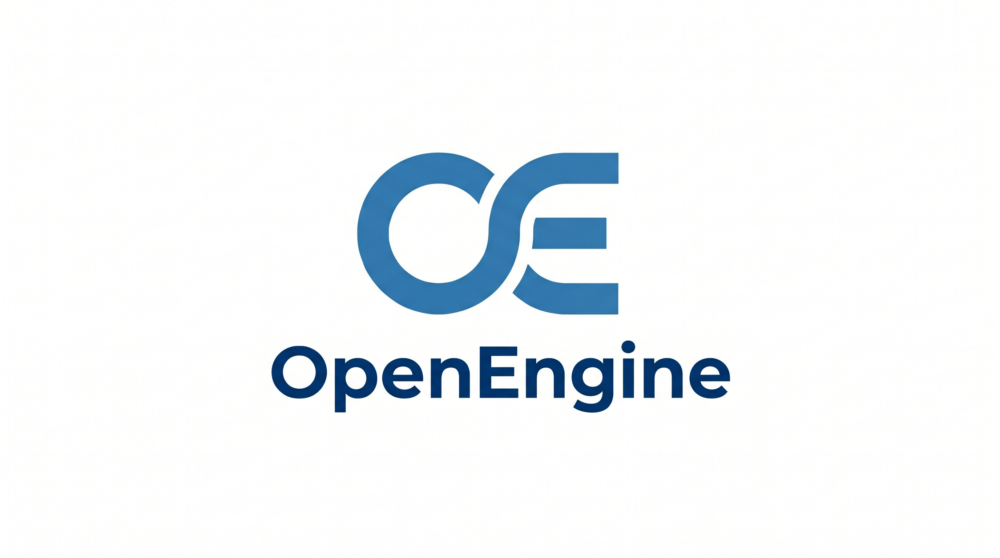
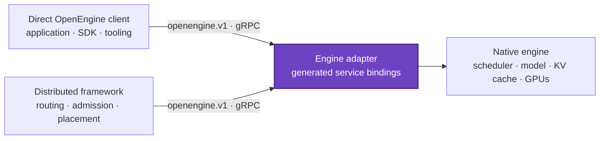

<!--
SPDX-FileCopyrightText: Copyright (c) 2026 NVIDIA CORPORATION & AFFILIATES. All rights reserved.
SPDX-License-Identifier: Apache-2.0
-->

<p align="center">
  
</p>

<p align="center">
  <strong>OpenEngine is a vendor-neutral gRPC protocol for coordinating inference engines and distributed frameworks.</strong>
</p>

<p align="center">
  Keep engine execution native. Connect distributed systems through one typed runtime contract.
</p>

<p align="center">
  <a href="https://github.com/ai-dynamo/openengine/actions/workflows/buf.yml"></a>
  <a href="LICENSE"></a>
  <a href="#project-status"></a>
  <a href="proto/openengine/v1/"></a>
  <a href="https://grpc.io/"></a>
  <a href="https://protobuf.dev/"></a>
</p>

<p align="center">
  <a href="docs/motivation.md">Why OpenEngine?</a>
  · <a href="docs/api.md">API reference</a>
  · <a href="proto/openengine/v1/">Canonical schema</a>
  · <a href="#generated-packages">Generated packages</a>
  · <a href="CONTRIBUTING.md">Contributing</a>
</p>

> [!IMPORTANT]
> OpenEngine is experimental and pre-adoption. The contract is being refined
> before its first engine implementations and may make direct breaking changes
> while it remains at schema revision `3`.

## Table of contents

- [Overview](#overview)
- [Why OpenEngine](#why-openengine)
- [Architecture](#architecture)
- [Capabilities](#capabilities)
- [Getting started](#getting-started)
- [Generated packages](#generated-packages)
- [Project status](#project-status)
- [Contributing](#contributing)
- [Security](#security)
- [License](#license)
- [Related projects and tools](#related-projects-and-tools)

## Overview

OpenEngine defines a runtime boundary around an inference engine. An engine
exposes the `openengine.v1.Inference` and `openengine.v1.Control` services.
Applications can call the inference service directly, while distributed
frameworks use both services to coordinate engine workers.

Both paths use generated clients and the same typed contract without sharing a
process, Python environment, dependency tree, or private control API.

## Why OpenEngine

Inference engines expose different runtime APIs. Direct users need
engine-specific clients, while every engine-framework pair needs a custom
adapter that tends to copy launch flags, import engine internals, or depend on
scheduler implementation details.

| Without a shared contract                           | With OpenEngine                                     |
| --------------------------------------------------- | --------------------------------------------------- |
| Engine-specific clients and framework integrations  | One generated protocol contract                     |
| Configuration duplicated into sidecars              | Engine capabilities discovered over RPC             |
| Engine upgrades coupled to framework code           | Engine-native execution behind a common endpoint    |
| Ad hoc cancellation and failure behavior            | Explicit lifecycle and terminal error semantics     |
| Backend-specific KV handoff shapes                  | Typed sessions with backend-specific extension data |

Read [Why OpenEngine](docs/motivation.md) for the full motivation, boundary, and
adoption model.

## Architecture



The adapter maps OpenEngine messages onto the engine's existing request path. A
direct client can use the generation and control APIs without a framework. In a
distributed deployment, the framework uses the same contract for discovery,
routing, lifecycle, and KV coordination. Native engine APIs can continue to
exist alongside OpenEngine.

## Capabilities

The canonical schema is organized by domain under
[`proto/openengine/v1/`](proto/openengine/v1/), with the service definition in
[`openengine.proto`](proto/openengine/v1/openengine.proto).

| Area                  | What the contract provides                                                                                        |
| --------------------- | ----------------------------------------------------------------------------------------------------------------- |
| Portable generation   | Text or token input, sampling, stopping, transport priorities, multiple sequences, and deterministic seeds        |
| Reserved task schemas | Typed embedding, classification, and grouped query/candidate scoring messages for a future task service           |
| Structured output     | JSON Schema, JSON object, regex, EBNF grammar, structural tags, and fixed choices                                 |
| Token information     | Prompt and output logprobs, ranks, candidate-token selection, per-token records, and streamed text deltas         |
| Discovery             | Server identity, deployment capacity, model limits, topology, parsers, and inference capabilities                 |
| Lifecycle             | Health checks, targeted or global abort, graceful drain, progress, and terminal failures                          |
| Disaggregated serving | Prefill/decode roles, decode-context parallel topology, KV handoff, connector discovery, and cache controls       |
| KV-aware routing      | Typed KV event streams plus discovery of engine-native event sources                                              |
| Model extensions      | Multimodal inputs and LoRA adapter lifecycle                                                                      |
| Observability         | Point-in-time load snapshots and reserved structured runtime-event messages                                       |

See the [human-readable API reference](docs/api.md) for field-level behavior and
validation rules.

## Getting started

### Clone and validate

Install [Buf](https://buf.build/docs/cli/installation/), then run:

```bash
git clone https://github.com/ai-dynamo/openengine.git
cd openengine

buf build
buf lint
```

Buf lint, Markdown lint, and link checks run in GitHub Actions for relevant
pull requests.

### Regenerate package bindings

The repository checks in generated Python and Rust bindings so that package
users do not need a protobuf compiler. Contributors changing the schema must
regenerate both packages:

```bash
python -m pip install grpcio-tools==1.81.1
./scripts/generate-python.sh
./scripts/generate-rust.sh
./scripts/check-generated.sh
```

Other protobuf-supported languages can generate clients and servers from the
same canonical package.

## Generated packages

Each OpenEngine release builds Python and Rust bindings from the same schema and
version tag. The artifacts contain generated code; installing them does not run
Buf or `protoc`. Initial consumers pin the OpenEngine repository at an immutable
commit and use path dependencies from that checkout.

### Python

```bash
pip install ./packages/python
```

```python
import grpc

from openengine.v1.generation_pb2 import GenerateRequest
from openengine.v1.openengine_pb2_grpc import InferenceStub

channel = grpc.aio.insecure_channel("localhost:50051")
engine = InferenceStub(channel)
request = GenerateRequest(request_id="example", model="model", prompt="Hello")
```

### Rust

```toml
openengine-proto = { path = "../openengine/packages/rust/openengine-proto" }
```

```rust
use openengine_proto::openengine::v1::{
    inference_client::InferenceClient,
    GenerateRequest,
};
```

The coordinated package version identifies the generated schema contents, but
not the exact source of a path or Git dependency. Both packages expose schema
revision `3`, minimum client revision `1`, and an `unreleased` identity sentinel.
Engine servers must inject their immutable OpenEngine commit SHA (or signed
release tag), and clients should inspect `ServerInfo` before accepting traffic.

| Package release | Protobuf package | Schema revision |
| --------------- | ---------------- | --------------- |
| `0.2.x`         | `openengine.v1`  | `2`             |
| `0.3.x`         | `openengine.v1`  | `3`             |

See [`RELEASING.md`](RELEASING.md) for the coordinated release process and
[`CHANGELOG.md`](CHANGELOG.md) for schema and package changes.

## Project status

OpenEngine is an experimental, pre-adoption API draft. The current focus is
making the contract coherent across inference engines before implementations
depend on it. Expect direct schema refinement during this phase.

The intended adoption path is incremental:

1. Aggregated generation, discovery, health, abort, and drain.
2. Prefill/decode roles, KV handoff, rank affinity, and KV event integration.
3. Logprobs, guided decoding, LoRA, and multimodal input as needed.

Have an engine or distributed framework use case that the contract does not
represent? Start a
[design discussion or issue](https://github.com/ai-dynamo/openengine/issues).

## Contributing

Issues, API-design feedback, and focused pull requests are welcome. Read
[`CONTRIBUTING.md`](CONTRIBUTING.md) before submitting changes.

All commits must include a Developer Certificate of Origin signoff:

```bash
git commit --signoff -m "docs: describe the change"
```

Please validate protobuf changes with Buf and keep
[`proto/openengine/v1/`](proto/openengine/v1/) and [`docs/api.md`](docs/api.md)
synchronized. Changes to the schema must also regenerate and commit both
language packages.

## Security

Do not report security vulnerabilities through a public issue. Follow the
instructions in [`SECURITY.md`](SECURITY.md) to contact NVIDIA PSIRT.

## License

OpenEngine is licensed under the
[Apache License 2.0](LICENSE).

## Related projects and tools

- [gRPC](https://grpc.io/) — the RPC transport used by OpenEngine.
- [Protocol Buffers](https://protobuf.dev/) — the schema and binding format.
- [Buf](https://buf.build/) — schema formatting, linting, and compatibility
  tooling.
