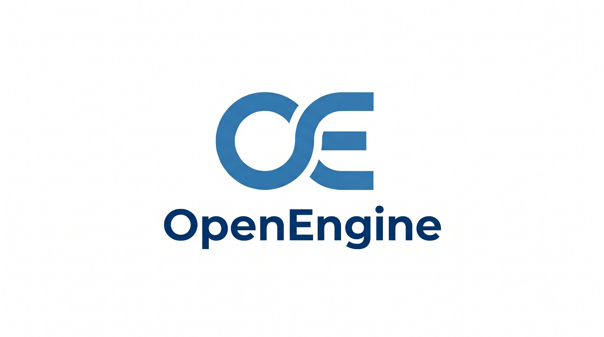
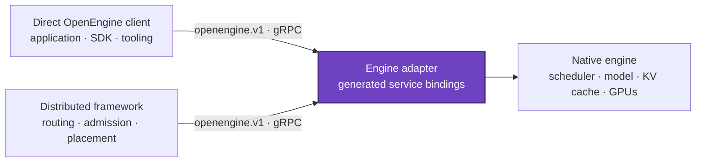

<!--
SPDX-FileCopyrightText: Copyright (c) 2026 NVIDIA CORPORATION & AFFILIATES. All rights reserved.
SPDX-License-Identifier: Apache-2.0
-->

<p align="center">
  
</p>

<p align="center">
  <strong>OpenEngine is a vendor-neutral gRPC protocol for coordinating inference engines and distributed frameworks.</strong>
</p>

<p align="center">
  Keep engine execution native. Connect distributed systems through one typed runtime contract.
</p>

<p align="center">
  <a href="https://github.com/ai-dynamo/openengine/actions/workflows/buf.yml"></a>
  <a href="https://github.com/ai-dynamo/openengine/releases/tag/v0.1.0"></a>
  <a href="LICENSE"></a>
  <a href="#project-status"></a>
  <a href="https://protobuf.dev/"></a>
</p>

<p align="center">
  <a href="docs/motivation.md">Why OpenEngine?</a>
  · <a href="docs/api.md">API reference</a>
  · <a href="proto/openengine/v1/">Canonical schema</a>
  · <a href="#release-v010">Release v0.1.0</a>
  · <a href="#consume-from-buf">Consume from Buf</a>
  · <a href="CONTRIBUTING.md">Contributing</a>
</p>

> [!IMPORTANT]
> OpenEngine v0.1.0 is the first experimental release. The contract is being refined before its first engine implementations and may make direct breaking changes while it remains at schema revision `1`.

## Table of contents

- [Overview](#overview)
- [Why OpenEngine](#why-openengine)
- [Architecture](#architecture)
- [Capabilities](#capabilities)
- [Getting started](#getting-started)
- [Release v0.1.0](#release-v010)
- [Consume from Buf](#consume-from-buf)
- [Project status](#project-status)
- [Contributing](#contributing)
- [Security](#security)
- [License](#license)
- [Related projects and tools](#related-projects-and-tools)

## Overview

OpenEngine defines a runtime boundary around an inference engine. An engine
exposes the `openengine.v1.Inference` and `openengine.v1.Control` services.
Applications can call the inference service directly, while distributed
frameworks use both services to coordinate engine workers.

Both paths use generated clients and the same typed contract without sharing a
process, Python environment, dependency tree, or private control API.

## Why OpenEngine

Inference engines expose different runtime APIs. Direct users need
engine-specific clients, while every engine-framework pair needs a custom
adapter that tends to copy launch flags, import engine internals, or depend on
scheduler implementation details.

| Without a shared contract                           | With OpenEngine                                     |
| --------------------------------------------------- | --------------------------------------------------- |
| Engine-specific clients and framework integrations  | One generated protocol contract                     |
| Configuration duplicated into sidecars              | Engine capabilities discovered over RPC             |
| Engine upgrades coupled to framework code           | Engine-native execution behind a common endpoint    |
| Ad hoc cancellation and failure behavior            | Explicit lifecycle and terminal error semantics     |
| Backend-specific KV handoff shapes                  | Typed sessions with backend-specific extension data |

Read [Why OpenEngine](docs/motivation.md) for the full motivation, boundary, and
adoption model.

## Architecture


```mermaid
flowchart LR
    D["Direct OpenEngine client<br/>application · SDK · tooling"]
    F["Distributed framework<br/>routing · admission · placement"]
    D -->|"openengine.v1 · gRPC"| A["Engine adapter<br/>generated service bindings"]
    F -->|"openengine.v1 · gRPC"| A
    A --> E["Native engine<br/>scheduler · model · KV cache · GPUs"]

    classDef boundary fill:#6f42c1,color:#fff,stroke:#4c2a85,stroke-width:2px;
    class A boundary;
```

The adapter maps OpenEngine messages onto the engine's existing request path. A
direct client can use the generation and control APIs without a framework. In a
distributed deployment, the framework uses the same contract for discovery,
routing, lifecycle, and KV coordination. Native engine APIs can continue to
exist alongside OpenEngine.

## Capabilities

The canonical schema is organized by domain under
[`proto/openengine/v1/`](proto/openengine/v1/), with the service definition in
[`openengine.proto`](proto/openengine/v1/openengine.proto).

| Area                  | What the contract provides                                                                                        |
| --------------------- | ----------------------------------------------------------------------------------------------------------------- |
| Portable generation   | Text or token input, sampling, stopping, transport priorities, multiple sequences, and deterministic seeds        |
| Structured output     | JSON Schema, JSON object, regex, EBNF grammar, structural tags, and fixed choices                                 |
| Token information     | Prompt and output logprobs, ranks, candidate-token selection, per-token records, and streamed text deltas         |
| Discovery             | Server identity, deployment capacity, model limits, topology, parsers, and inference capabilities                 |
| Lifecycle             | Health checks and targeted or global abort                                                                        |
| Disaggregated serving | Prefill/decode roles, decode-context parallel topology, KV handoff, connector discovery, and cache controls       |
| KV-aware routing      | Typed KV event streams plus discovery of engine-native event sources                                              |
| Model extensions      | Multimodal inputs and LoRA adapter lifecycle                                                                      |
| Observability         | Point-in-time load snapshots                                                                                      |

See the [human-readable API reference](docs/api.md) for field-level behavior and
validation rules.

## Getting started

### Clone and validate

Install [Buf](https://buf.build/docs/cli/installation/), then run:

```bash
git clone https://github.com/ai-dynamo/openengine.git
cd openengine

buf format --diff --exit-code
buf build
buf lint
```

Markdown lint and link checks run in GitHub Actions for relevant pull requests.
Run the Buf checks locally before opening a protocol change.

## Release v0.1.0

[OpenEngine v0.1.0](https://github.com/ai-dynamo/openengine/releases/tag/v0.1.0) is available as a signed Git tag and an immutable Buf Schema Registry module commit.

| Artifact | Release identifier |
| --- | --- |
| Protobuf package | `openengine.v1` |
| Schema revision | `1` |
| Git tag | [`v0.1.0`](https://github.com/ai-dynamo/openengine/tree/v0.1.0) |
| Git commit | [`b5f2bd93721f7b888d3e2440679e0ae7012939d1`](https://github.com/ai-dynamo/openengine/commit/b5f2bd93721f7b888d3e2440679e0ae7012939d1) |
| BSR module | [`buf.build/openengine/openengine`](https://buf.build/openengine/openengine) |
| Immutable BSR commit | `768a93c7b44e40f28c692ad0b471a8f2` |

Use the immutable BSR commit as the dependency identifier. The `v0.1.0` and `main` BSR labels identify the same published content but are intended for discovery rather than production pinning.

## Consume from Buf

OpenEngine is distributed as the [`buf.build/openengine/openengine`](https://buf.build/openengine/openengine) module. Consumers can use [BSR-generated SDKs](https://buf.build/docs/bsr/generated-sdks/) or generate bindings with their own version-pinned plugins. OpenEngine does not currently maintain first-party language packages.

Generate bindings for v0.1.0 from the immutable module input with the consumer's language-specific `buf.gen.yaml`:

```bash
buf generate buf.build/openengine/openengine:768a93c7b44e40f28c692ad0b471a8f2
```

Consumers that import OpenEngine from their own Protobuf module may instead declare it in `buf.yaml`; commit the resulting `buf.lock` so builds resolve the same content. Keep generator plugins version-pinned in `buf.gen.yaml`.

Servers implementing this contract advertise schema revision `1`, minimum
client revision `1`, and the immutable BSR module commit they consumed in
`ServerInfo.schema_release`. Unpublished local builds may use an immutable
OpenEngine source commit instead.

See [`RELEASING.md`](RELEASING.md) for BSR publication.

## Project status

OpenEngine v0.1.0 is an experimental, pre-adoption release. The current focus is making the contract coherent across inference engines before implementations depend on it. Expect direct schema refinement during this phase.

The intended adoption path is incremental:

1. Aggregated generation, discovery, health, and abort.
2. Prefill/decode roles, KV handoff, rank affinity, and KV event integration.
3. Logprobs, guided decoding, LoRA, and multimodal input as needed.

Have an engine or distributed framework use case that the contract does not
represent? Start a
[design discussion or issue](https://github.com/ai-dynamo/openengine/issues).

## Contributing

Issues, API-design feedback, and focused pull requests are welcome. Read
[`CONTRIBUTING.md`](CONTRIBUTING.md) before submitting changes.

All commits must include a Developer Certificate of Origin signoff:

```bash
git commit --signoff -m "docs: describe the change"
```

Please validate protobuf changes with Buf and keep
[`proto/openengine/v1/`](proto/openengine/v1/) and [`docs/api.md`](docs/api.md)
synchronized.

## Security

Do not report security vulnerabilities through a public issue. Follow the
instructions in [`SECURITY.md`](SECURITY.md) to contact NVIDIA PSIRT.

## License

OpenEngine is licensed under the
[Apache License 2.0](LICENSE).

## Related projects and tools

- [gRPC](https://grpc.io/) — the RPC transport used by OpenEngine.
- [Protocol Buffers](https://protobuf.dev/) — the schema and binding format.
- [Buf](https://buf.build/) — schema formatting, linting, and compatibility
  tooling.
