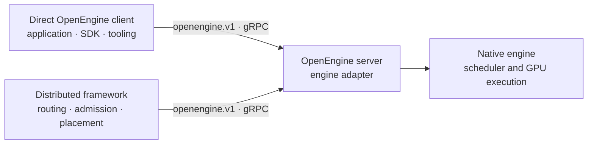

<!--
SPDX-FileCopyrightText: Copyright (c) 2026 NVIDIA CORPORATION & AFFILIATES. All rights reserved.
SPDX-License-Identifier: Apache-2.0
-->

# Why OpenEngine

OpenEngine defines a runtime boundary around an inference engine. Applications
can call it directly, and distributed frameworks can use the same contract to
coordinate engine workers. The client and engine can change without sharing a
process, dependency tree, or private control API.

## The integration problem

Inference engines already own request execution:

- scheduling and batching;
- tokenization and detokenization;
- KV-cache allocation and transfer;
- multimodal preprocessing;
- guided decoding, LoRA, and logprobs;
- engine-specific performance work.

Distributed frameworks add a different set of concerns when coordinating
workers:

- discovery and routing;
- admission and load balancing;
- prefill/decode placement;
- health, drain, and cancellation policy;
- KV-aware scheduling across workers.

Without a shared boundary, direct users need engine-specific clients and every
engine-framework pair needs a separate adapter. These integrations often import
the engine, copy its launch flags, or depend on scheduler details. Engine
upgrades then force changes in client or framework code.

## The boundary

The engine implements the OpenEngine server. Direct applications and
distributed frameworks use generated clients. A direct client can use
generation and control APIs without a framework; a distributed framework can
also discover model, role, topology, limits, and supported features instead of
duplicating engine configuration.

The engine remains the authority for request execution. OpenEngine carries the
request and control data needed across the process boundary.

## What the protocol covers

| Area | Contract |
| --- | --- |
| Generation | Streaming tokens, usage, finish state, and errors |
| Discovery | Server, model, engine role, topology, limits, and capabilities |
| Lifecycle | Health, abort, and drain |
| Scheduling | Load data, data-parallel rank affinity, and decode-context parallel topology |
| Disaggregation | Prefill readiness, KV-session handoff, and connector data |
| KV routing | Event streams and native event-source discovery |

The [API reference](api.md) defines the fields. The
[`openengine.v1` schema](../proto/openengine/v1/) is the source of truth.

## What stays engine-specific

OpenEngine does not define:

- scheduler or radix-cache internals;
- native request dictionaries;
- kernel selection or batching policy;
- KV-transfer implementation;
- speculative decoding strategy;
- native HTTP or gRPC APIs.

An engine maps OpenEngine messages to its existing request path. It can keep
native APIs and expose OpenEngine to direct clients and distributed frameworks.

## OpenEngine and OpenAI-compatible APIs

The two APIs serve different callers.

- An OpenAI-compatible API is a client-facing product API. It accepts chat or
  completion requests and hides deployment topology.
- OpenEngine is a runtime protocol. It exposes engine role, load, lifecycle,
  KV handoff, rank affinity, and event sources to its clients.

OpenEngine can be called directly by engine users, applications, and tooling. A
distributed framework may instead accept OpenAI-compatible traffic, normalize
it, and use OpenEngine between its router and engine workers. Engines can
continue exposing their existing client APIs alongside OpenEngine.

## Why an engine would implement it

- One server contract can support direct clients and multiple distributed
  frameworks.
- The engine keeps its launch path, dependencies, and scheduler.
- Framework-side clients can run in small CPU-only processes.
- Engine and client releases can move independently within the protocol's
  compatibility rules.
- Disaggregated serving uses a common handoff shape without requiring a common
  transfer backend.

There are costs:

- New engine features may need new optional fields.
- Standard enums can be less detailed than native state.
- Each engine still needs a translation layer.
- Wire compatibility limits how existing fields can change.

These constraints are explicit. They replace hidden coupling in per-engine
integrations.

## Adoption path

An implementation can add support in stages:

1. Aggregated text generation, discovery, health, abort, and drain.
2. Prefill/decode roles, KV handoff, rank affinity, and KV events.
3. Logprobs, guided decoding, LoRA, and multimodal input as needed.

Capability fields let clients reject unsupported requests or select compatible
workers.

## Implementation status

OpenEngine is pre-adoption and has no production engine implementations today.
The contract is designed for engines such as vLLM, SGLang, and TensorRT-LLM and
for both direct clients and distributed frameworks such as Dynamo.

These are intended integration targets, not claims that those projects
currently implement OpenEngine. Scheduling, request conversion, and KV transfer
remain engine-owned in any future adapter.
