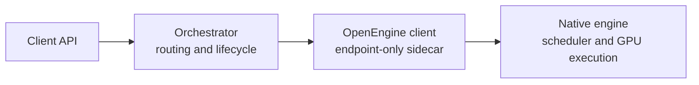

<!--
SPDX-FileCopyrightText: Copyright (c) 2026 NVIDIA CORPORATION & AFFILIATES. All rights reserved.
SPDX-License-Identifier: Apache-2.0
-->

# Why OpenEngine

OpenEngine defines the runtime boundary between an inference engine and an
orchestrator. It lets each side change without sharing a process, dependency
tree, or private control API.

## The integration problem

Inference engines already own request execution:

- scheduling and batching;
- tokenization and detokenization;
- KV-cache allocation and transfer;
- multimodal preprocessing;
- guided decoding, LoRA, and logprobs;
- engine-specific performance work.

Orchestrators own a different set of concerns:

- discovery and routing;
- admission and load balancing;
- prefill/decode placement;
- health, drain, and cancellation policy;
- KV-aware scheduling across workers.

Without a shared boundary, every engine-orchestrator pair needs a separate
adapter. These adapters often import the engine, copy its launch flags, and
depend on scheduler details. Engine upgrades then become orchestrator upgrades.

## The boundary

The engine implements the OpenEngine server. The orchestrator implements the
client. The sidecar discovers the model, role, topology, limits, and supported
features from the engine instead of duplicating engine configuration.

The engine remains the authority for request execution. OpenEngine carries the
request and control data needed across the process boundary.

## What the protocol covers

| Area | Contract |
|---|---|
| Generation | Streaming tokens, usage, finish state, and errors |
| Discovery | Engine, model, role, topology, limits, and capabilities |
| Lifecycle | Health, abort, and drain |
| Scheduling | Load data and data-parallel rank affinity |
| Disaggregation | Prefill readiness, KV-session handoff, and connector data |
| KV routing | Event streams and native event-source discovery |

The [API reference](api.md) defines the fields. The
[proto](../proto/openengine.proto) is the source of truth.

## What stays engine-specific

OpenEngine does not define:

- scheduler or radix-cache internals;
- native request dictionaries;
- kernel selection or batching policy;
- KV-transfer implementation;
- speculative decoding strategy;
- native HTTP or gRPC APIs.

An engine maps OpenEngine messages to its existing request path. It can keep
native APIs for direct clients and expose OpenEngine for orchestrators.

## OpenEngine and OpenAI-compatible APIs

The two APIs serve different callers.

- An OpenAI-compatible API is a client-facing product API. It accepts chat or
  completion requests and hides deployment topology.
- OpenEngine is a runtime protocol. It exposes engine role, load, lifecycle,
  KV handoff, rank affinity, and event sources to an orchestrator.

OpenEngine does not ask users to replace their client API. An orchestrator may
accept OpenAI-compatible traffic, normalize it, and use OpenEngine between its
router and engine workers.

## Why an engine would implement it

- One server contract can support multiple orchestrators.
- The engine keeps its launch path, dependencies, and scheduler.
- The orchestrator can run in a small CPU-side process.
- Engine and orchestrator releases can move independently within the protocol's
  compatibility rules.
- Disaggregated serving uses a common handoff shape without requiring a common
  transfer backend.

There are costs:

- New engine features may need new optional fields.
- Standard enums can be less detailed than native state.
- Each engine still needs a translation layer.
- Wire compatibility limits how existing fields can change.

These constraints are explicit. They replace hidden coupling in per-engine
integrations.

## Adoption path

An implementation can add support in stages:

1. Aggregated text generation, discovery, health, abort, and drain.
2. Logprobs, guided decoding, LoRA, and multimodal input as needed.
3. Prefill/decode roles, KV handoff, rank affinity, and KV events.

Capability fields let the orchestrator reject unsupported requests or choose a
compatible worker.

## Existing implementations

The current vLLM and SGLang integrations use the same OpenEngine contract and
different engine adapters:

- vLLM exposes a Rust gRPC service backed by its text-generation path.
- SGLang exposes an opt-in OpenEngine serve mode bridged to its scheduler.
- Dynamo uses endpoint-configured sidecars and discovers engine state over RPC.

The shared contract is the common part. Scheduling, request conversion, and KV
transfer remain engine-owned.
